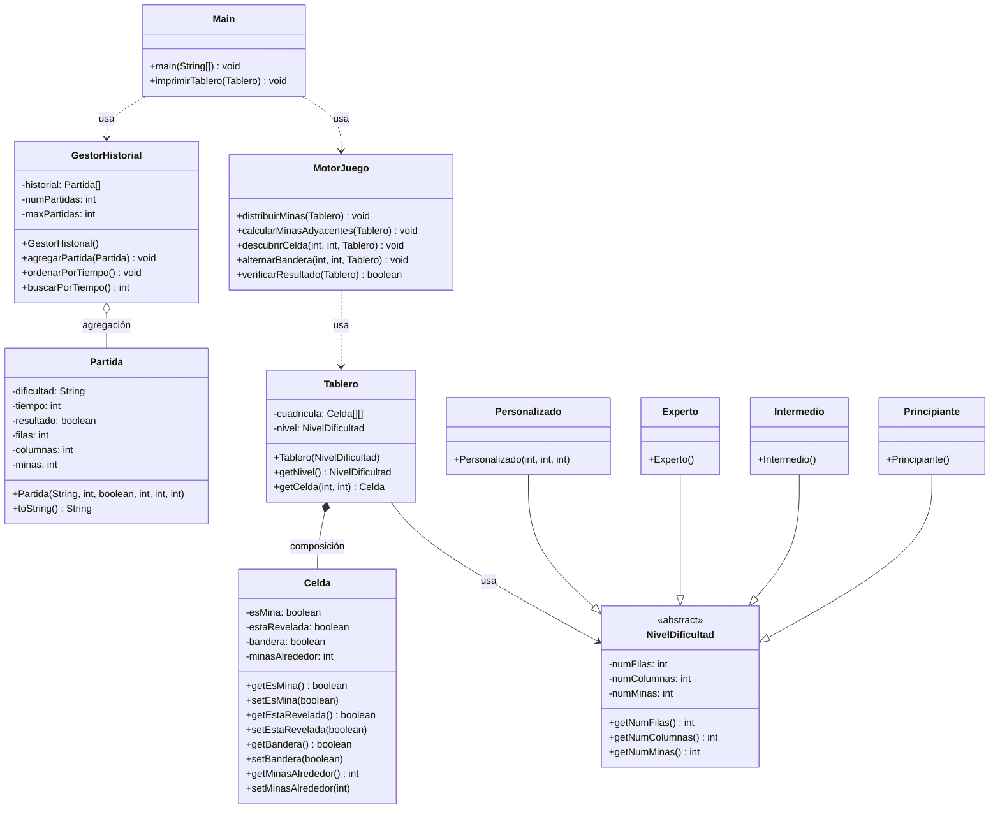

```mermaid
classDiagram
    class Main {
        +main(String[]) void
        +imprimirTablero(Tablero) void
    }

    class GestorHistorial {
        -historial: Partida[]
        -numPartidas: int
        -maxPartidas: int
        +GestorHistorial()
        +agregarPartida(Partida) void
        +ordenarPorTiempo() void
        +buscarPorTiempo() int
    }

    class Partida {
        -dificultad: String
        -tiempo: int
        -resultado: boolean
        -filas: int
        -columnas: int
        -minas: int
        +Partida(String, int, boolean, int, int, int)
        +toString() String
    }

    class MotorJuego {
        +distribuirMinas(Tablero) void
        +calcularMinasAdyacentes(Tablero) void
        +descubrirCelda(int, int, Tablero) void
        +alternarBandera(int, int, Tablero) void
        +verificarResultado(Tablero) boolean
    }

    class Tablero {
        -cuadricula: Celda[][]
        -nivel: NivelDificultad
        +Tablero(NivelDificultad)
        +getNivel() NivelDificultad
        +getCelda(int, int) Celda
    }

    class Celda {
        -esMina: boolean
        -estaRevelada: boolean
        -bandera: boolean
        -minasAlrededor: int
        +getEsMina() boolean
        +setEsMina(boolean)
        +getEstaRevelada() boolean
        +setEstaRevelada(boolean)
        +getBandera() boolean
        +setBandera(boolean)
        +getMinasAlrededor() int
        +setMinasAlrededor(int)
    }

    class NivelDificultad {
        <<abstract>>
        -numFilas: int
        -numColumnas: int
        -numMinas: int
        +getNumFilas() int
        +getNumColumnas() int
        +getNumMinas() int
    }

    class Personalizado {
        +Personalizado(int, int, int)
    }

    class Experto {
        +Experto()
    }

    class Intermedio {
        +Intermedio()
    }

    class Principiante {
        +Principiante()
    }

    Main ..> GestorHistorial : usa
    Main ..> MotorJuego : usa
    MotorJuego ..> Tablero : usa
    GestorHistorial o-- Partida : agregación
    Tablero *-- Celda : composición
    Tablero --> NivelDificultad : usa
    Personalizado --|> NivelDificultad
    Experto --|> NivelDificultad
    Intermedio --|> NivelDificultad
    Principiante --|> NivelDificultad
```
