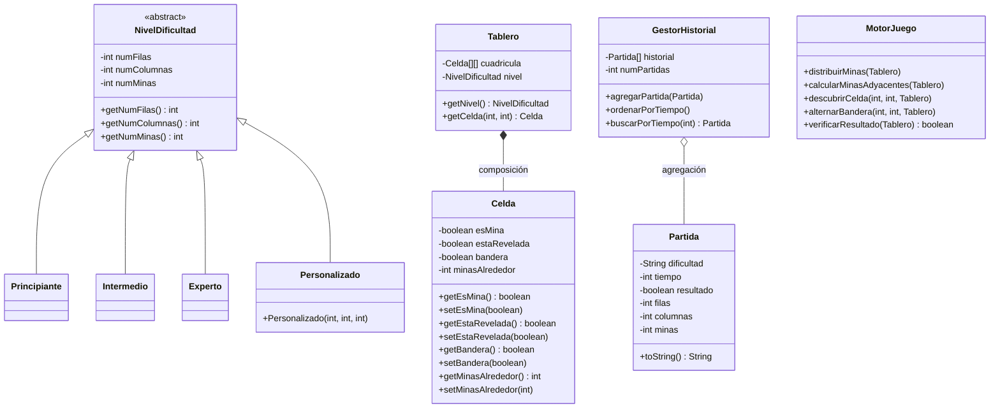

# Documento de diseño — Buscaminas en Terminal

---

## 1. Descomposición del problema

Para comenzar, se ha de tener en cuenta que el programa fue dividido en 3 capas: Consola, Lógica y Modelos.

Esta descomposición fue necesaria, ya que existe una dependencia entre capas clara entre cada una, ya que sin **Modelos**, las demás pierden sentido, pues allí encontramos los modelos de datos, aquellos elementos requeridos en el problema y que son la mayor parte de parámetros del problema; luego, encontramos **Lógica**, que es donde se encuentran los procesos que debe llevar a cabo el sistema para el correcto funcionamiento del mismo, como `GestorHistorial`, que aunque no afecte la experiencia de juego directamente en la partida, trabaja internamente para poder acceder a ella al finalizar, y `MotorJuego` que es lo que hace que el sistema funcione como tal; y finalmente, **Consola**, donde está únicamente el main, pues es lo que se mostrará por esta misma y es lo único que el usuario necesita ver, lo cual nos lleva al siguiente punto:

La separación entre vista y modelo se hace realmente necesaria en este caso, ya que hay numerosos elementos que componen el sistema, y al usuario no solo no le interesan, sino que podrían arruinar su experiencia de juego en caso de hacerlos visibles de alguna manera; es por ello que se tienen en un lugar aparte y son invocados cuando se requieran para mostrarlos en pantalla o utilizarlos en alguna operación. Por otro lado, tenemos el **encapsulamiento**, utilizado ampliamente para que únicamente se pueda acceder a los atributos por medio de getters y setters, ocultando los detalles internos de cómo funciona y restringiendo el acceso directo a ellos, manteniendo así una interfaz pública sencilla y evitando que otros componentes del sistema los modifiquen accidentalmente.

---

## 2. Decisiones de diseño orientado a objetos

### Herencia

En cuanto a las decisiones de diseño orientado a objetos, la primera de ellas fue utilizar **herencia** para las dificultades del juego, decisión tomada por practicidad para evitar la duplicación de código declarando los atributos individualmente. En cambio, de esta manera simplemente se declaran en la clase padre (en este caso, clase abstracta) que sería `NivelDificultad`, se inicializan los atributos `numFilas`, `numColumnas` y `numMinas`, de manera que cada subclase las herede y utilice `super` para invocar la clase padre y darle un valor a los atributos, ya sea predeterminado, como en los tres niveles principales que ya están definidos por el problema, o personalizado, como en la clase que lleva este mismo nombre, demostrando que la jerarquía es flexible.

### Composición

Otra decisión de diseño fue la **composición** entre `Tablero` y `Celda`. Aunque la clase `Celda` existe de manera independiente con sus atributos, una instancia real de celda no puede existir sin el tablero, ya que es este quien las fabrica dentro de su constructor. Esto es similar a un tablero de ajedrez, donde los espacios solo existen dentro del tablero, identificados por su fila y columna, al igual que las celdas en un arreglo bidimensional. Por lo tanto, el ciclo de vida de cada celda depende completamente de la clase `Tablero`.

### Agregación

Por otro lado, tenemos una relación de **agregación**. A diferencia de la composición, aquí nace primero la partida, realiza su ciclo y una vez finaliza, su información es recopilada y almacenada por `GestorHistorial`. Esto significa que `Partida` no depende de `GestorHistorial`, pues aunque este no existiera, la partida podría seguir existiendo sin ningún problema.

---

## 3. Elección de estructuras de datos

Para el tablero, lo mejor es utilizar `Celda[][]`, debido a que este tipo de arreglos son estáticos, es decir, una vez el jugador elija su dificultad, ya sea una predefinida o una personalizada, las características de esta no cambiarán durante la partida. Sin embargo, para el historial sí es preferible emplear `ArrayList`, debido a que no se sabe cuántas partidas se jugarán y por ello se hace necesario un arreglo dinámico, apto para almacenar un número n de partidas, ya sea 1, 2, 100, etc.

---

## 4. Flujo principal del juego

Al comenzar el juego, se le darán al usuario 5 opciones: elegir entre los 3 modos de dificultad predeterminados, crear su propia dificultad, o ver el historial de partidas, que en caso de estar vacío mostrará un mensaje indicándolo. Una vez la dificultad es escogida, el juego iniciará: las minas serán distribuidas internamente antes de que se haga la primera jugada, al igual que el cálculo de las minas adyacentes a cada casilla que no contiene explosivo; el contador de tiempo comenzará y se imprimirá en pantalla una matriz del tamaño acorde a la dificultad.

El usuario deberá ingresar en la terminal el número de fila y seguido a esto el número de columna, luego se le pedirá elegir entre descubrir o poner/quitar bandera según sea el caso. El juego finalizará cuando el usuario detone una mina o descubra todas las casillas que no contienen explosivos, lo que suceda primero.

Una vez el juego haya finalizado, el contador de tiempo se detendrá y el programa le pedirá elegir entre las siguientes opciones: volver a jugar, ver el historial de partidas o salir del programa. En caso de elegir el historial, se imprimirán las partidas llevadas a cabo, indicando la dificultad y si el usuario ganó o perdió; además, las partidas aparecerán ordenadas de menor a mayor tiempo gracias al **BubbleSort**. Adicionalmente, el usuario podrá buscar una partida específica por su tiempo de duración, lo cual es posible gracias a la implementación de **BinarySearch** sobre el historial previamente ordenado.

---

## 5. Diagrama de clases


```

---

> 📅 Entrega: 24 de Mayo de 2026 — Curso de Pensamiento Computacional
